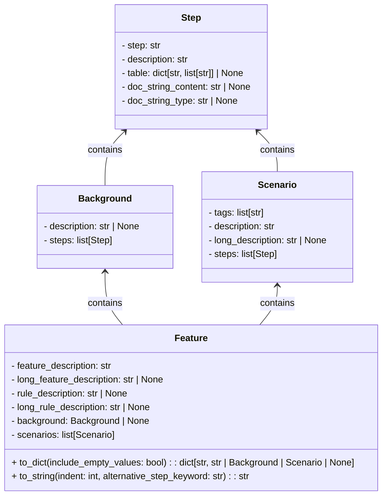

```mermaid
classDiagram
    class Step {
        - step: str
        - description: str
        - table: dict[str, list[str]] | None
        - doc_string_content: str | None
        - doc_string_type: str | None
    }

    class Scenario {
        - tags: list[str]
        - description: str
        - long_description: str | None
        - steps: list[Step]
    }

    class Background {
        - description: str | None
        - steps: list[Step]
    }

    class Feature {
        - feature_description: str
        - long_feature_description: str | None
        - rule_description: str | None
        - long_rule_description: str | None
        - background: Background | None
        - scenarios: list[Scenario]
        + to_dict(include_empty_values: bool): dict[str, str | Background | Scenario | None]
        + to_string(indent: int, alternative_step_keyword: str): str
    }

    Step <-- Scenario : contains
    Step <-- Background : contains
    Background <-- Feature : contains
    Scenario <-- Feature : contains
```