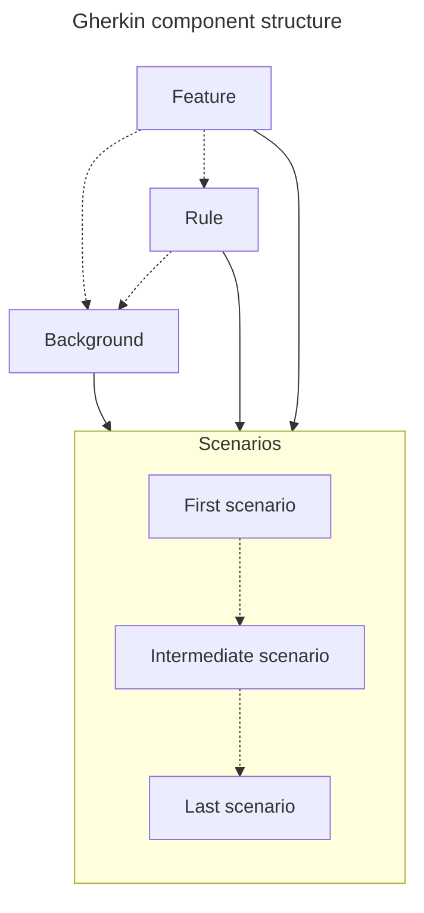

# Gherkin Structure

This document outlines the expected structure for a Gherkin feature file to be processed by the Gherkin processor.

## Structure



*Note: the dotted lines indicate optional connections*

### Feature

Provides a high-level description of a software feature and groups related *scenarios*.

**Syntax:**

```gherkin
Feature: <short feature description>
```
```gherkin
Feature: <short feature description>
<optional markdown description>
```

### Rule

> Optional component

Represents one rule that should be implemented and provides additional information about the *feature*.

**Syntax:**

```gherkin
Rule: <short rule description>
```
```gherkin
Rule: <short rule description>
<optional markdown description>
```

### Background

> Optional component

Defines steps that are common to all *scenarios* in the *feature* or *rule*.

**Syntax:**

```gherkin
Background:
Given <common step>
```
```gherkin
Background:
<optional markdown description>
Given <common step>
And <additional common 'Given' step>
```

### Scenario

Represents a specific test case with a sequence of steps to verify or validate a particular behavior.

**Syntax:**

```gherkin
Scenario: <short scenario description>
Given <initial context>
When <event occurs>
Then <outcome>
```
```gherkin
@<optional_tag>
@<additional_optional_tag> @<additional_optional_tag>
Scenario Outline: <short scenario description>
<optional markdown description>
Given <initial context>
And <additional 'Given' step>
<optional step table>
When <event occurs>
And <additional 'When' step>
<optional step document-string>
Then <positive outcome>
And <additional 'Then' step>
When <event occurs>
And <additional 'When' step>
Then <positive outcome>
But <negative outcome>
And <additional 'But' step>

Scenarios:
<scenario table>
```

*Alternative keywords:*
- Scenario → Example
- Scenario Outline → Scenario Template
- Scenarios → Examples

## Examples

### Simple example

```gherkin
Feature: Making breakfast

  Scenario: Making coffee
    Given I have coffee grounds
    When I add hot water
    Then I get a cup of coffee
```

### Complex example

```gherkin
Feature: Making breakfast
Describes a morning routine regarding breakfast making of an average person.

  Rule: Only one breakfast meal should be prepared
  The morning routine should include breakfast for only one person.

    Background:
    The default assumption is that every breakfast comes with coffee.
      Given I have coffee grounds
      And I add hot water
      And I get a cup of coffee

        @european
        @american @canadian
        Scenario: Making pancake
          Given I have pancake mix prepared the following way:
          """
            Add ½ cup milk, 1 cup baking mix, 1 tbsp olive oil and 1 egg into a bowl.
            Stir the mix until the texture is consistent.
          """
          When I cook the prepared pancake mix
          Then I get a cooked pancake
          When I top the pancake with the following ingredients:
          | ingredient  |
          | Butter      |
          | Maple syrup |
          | Blueberry   |
          Then I get an american pancake
          When I wait for the pancake to cool down
          Then the pancake is edible
          But the butter is melted

        @american
        Scenario Outline: Making eggs
        This scenario does not include all the egg making method, only selected ones.
          Given I have fresh eggs
          And I prepare the eggs by <preparing>
          When I <cook> the eggs for "<minute>" minutes
          Then I get "<name>" eggs

        Scenarios:
          | name          | preparing                        | cook  | minute |
          | Sunny side up | cracking it into a pan           | fry   | 3      |
          | Scrambled     | mixing it till consistency       | fry   | 5      |
          | Soft boiled   | placing it in boiling water      | boil  | 6      |
          | Hard boiled   | placing it in boiling water      | boil  | 12     |
          | Poached       | cracking it into simmering water | poach | 4      |
```